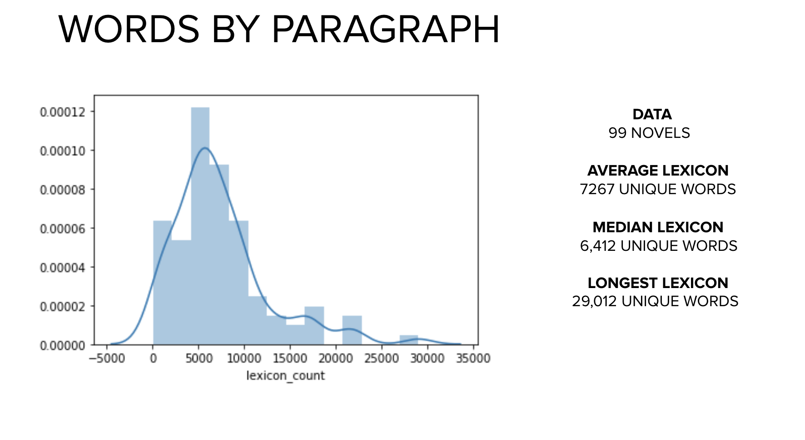
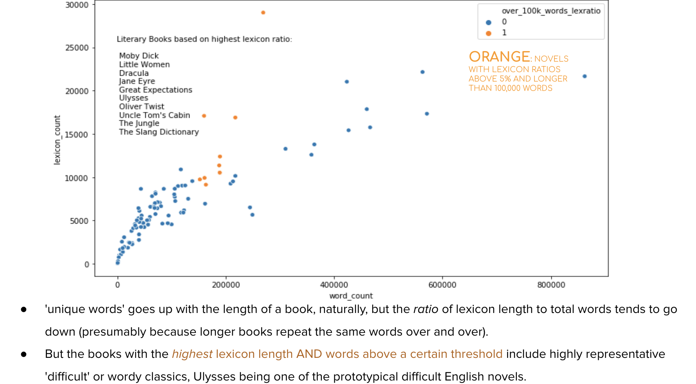
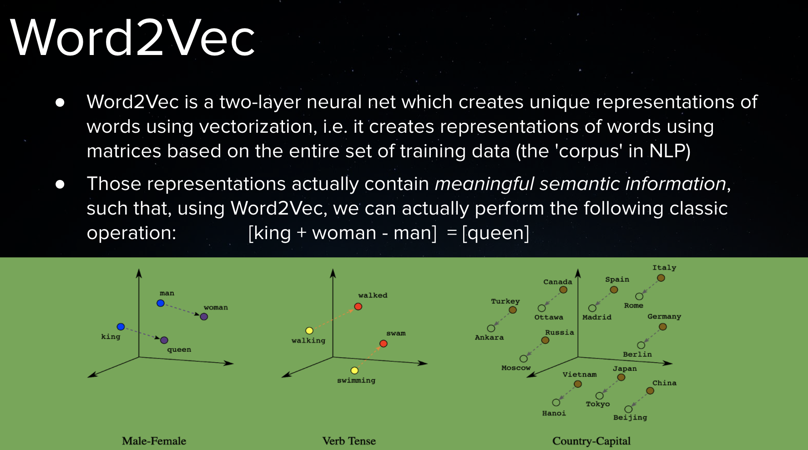
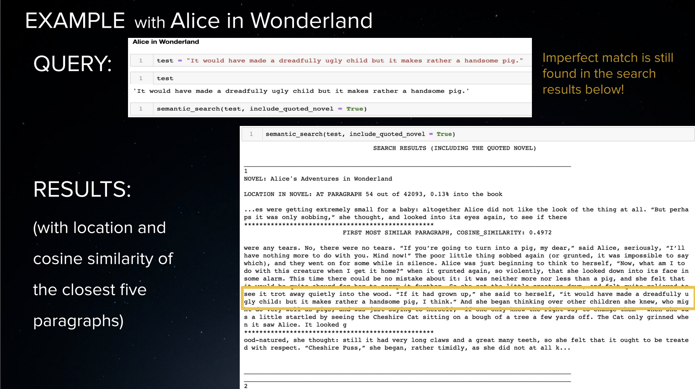
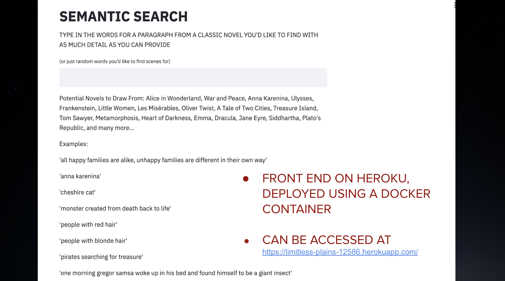

# Semantic Search
[Presentation in Repository](https://github.com/bphall/semantic_search/blob/master/finalsem.pdf)
### Introduction
by Brayton Hall

- [Data](#data)
- [EDA](#eda)
- [Doc2Vec](#model)
- [Front End on Heroku](#frontend)

## Motivation
My aim was to build a specialized semantic search engine, which can return the most similar paragraphs to an input string. In other words, a 'search-between-lines' app, to search by connotations and misremembered quotes, rather than exact fragments. This was inspired by the frustrations of simple search engines on e-readers and websites, such as a Kindle. 
 

## Data from Project Gutenberg 
The data  includes 100 of the top 'free ebooks' from Project Gutenberg, scraped with BeautifulSoup. It contains approximately 12 million words, cleaned and tokenized, and approximately 57,000 paragraphs, each 12,000 characters long. Engineered features in Pandas include 'lexicon' or unique word count, and 'lexicon ratio', a marker of literary uniqueness for identifying more difficult prose or 'wordiness'. 

## EDA 
The following shows general info about the novels collected.
### 
The following graphic shows the sweet spot in the data of books with high (>5%) lexicon ratios which are also longer than 100,000 words, identifying a 'literary' subsection of prototypical difficult or wordy English novels, such as Ulysses and Moby Dick. 
### 

## Doc2Vec Model 
### 
### Tagging
Just like Word2Vec, Doc2Vec creates vector representations of words. Doc2Vec also creates vector representations of documents, which are paragraphs here (I arbitrarily decided 1200 characters  == 1 paragraph). In order for Doc2Vec to vectorize tokenized docs, each doc (paragraph) must be 'Tagged'. For example, the first paragraph of Anna Karenina: 

TaggedDocument(words=['happy', 'families', 'are', 'all', 'alike', 'every', 'unhappy', 'family', 'is', 'unhappy', 'in', 'its', 'own', 'way'...'after', 'the', 'quarrel', 'prince'], tags=['47831'])

This is paragraph 47,831 in my entire corpus of approx. 57, 000 paragraphs.

### Vectorizing 
Doc2Vec Parameters for Modelling:
- Vector size of 300 (each paragraph is represented as a vector with 300 dimension)
- Learning rate of .01
- 200 Epochs
- Window size of 20 (for tokens, since word order in paragraphs matters) 

The model was pickled (150 mb size, 20 min to build) and stored on an AWS bucket on S3.

## Implementation
The following is an example of how the search function can be used locally in a jupyter notebook, though a front end for the app can be found on Heroku.  
### 

## Front End on Heroku 
Deployed using a Docker container. 
### 
Can be accessed at https://limitless-plains-12586.herokuapp.com/
 

